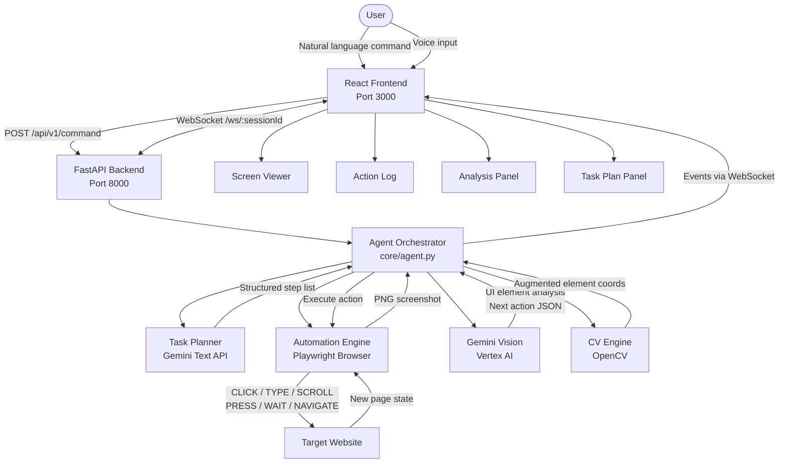

# AccessPilot — System Architecture

## Full Pipeline



## Component Responsibilities

| Component | File | Role |
|-----------|------|------|
| React Frontend | `frontend/src/` | UI, command input, live screen, action log |
| FastAPI Backend | `backend/main.py` | REST API, WebSocket hub, session management |
| Agent Orchestrator | `core/agent.py` | Main feedback loop, coordinates all subsystems |
| Gemini Client | `core/gemini_client.py` | Vision analysis, task planning, action generation |
| Automation Engine | `engine/automation.py` | Playwright browser control, screenshot capture |
| CV Engine | `vision/cv_engine.py` | OpenCV button/input detection, annotation |
| Session Manager | `core/session_manager.py` | Per-session state and lifecycle |
| WebSocket Manager | `core/websocket_manager.py` | Real-time event broadcasting to frontend |

## Data Flow Per Step

```
1. Screenshot captured        (Playwright → PNG → base64)
2. CV pre-processing          (OpenCV → candidate element regions)
3. Gemini vision analysis     (Vertex AI → structured JSON)
4. Action decision            (Gemini → CLICK/TYPE/SCROLL/etc.)
5. Action execution           (Playwright → browser interaction)
6. Event broadcast            (WebSocket → frontend panels update)
7. Repeat until task complete or max steps reached
```

## Cloud Deployment

```
Firebase Hosting  ──→  React SPA (CDN)
        │
        ▼
Cloud Run  ──→  FastAPI Backend (containerised)
        │
        ▼
Vertex AI  ──→  Gemini 1.5 Pro Vision
        │
        ▼
Cloud Storage  ──→  Screenshot archive (optional)
```
